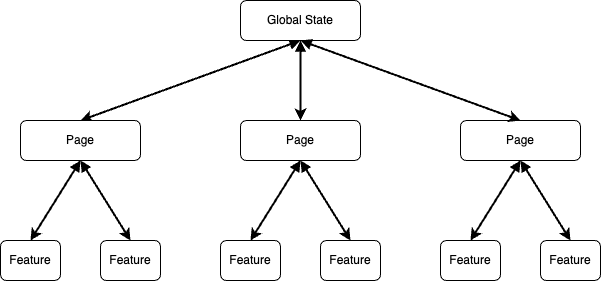

```{r setup, include = FALSE}
options(htmltools.dir.version = FALSE)
library(knitr)
library(tidyverse)
library(fontawesome)
xaringanExtra::use_panelset()
```


class: title-slide, right, top
background-image: url(img/gamepad.png)
background-position: center 70%
background-size: 20%, cover
background-color: #fafafa

.big-title[
# `r rmarkdown::metadata$title`

**`r rmarkdown::metadata$author`**<br>
`r rmarkdown::metadata$date`
]

---
name: about-me
layout: false
class: about-me-slide, middle, center

# About me

  
  
  .list[
    [`r fa("house")` aljrico.com](https://aljrico.com) <br>
    [`r fa("twitter")` @aljrico](https://twitter.com/aljrico) <br>
    [`r fa("github")` /aljrico](https://github.com/aljrico) <br>
  ]

---

name: outline
layout: false
class: middle, outline

# Outline
.fluid-row[
.pull-left-wide[
<link rel="stylesheet" href="https://cdnjs.cloudflare.com/ajax/libs/font-awesome/6.2.0/css/all.min.css">
<ul class="fa-ul">
  <li><span class="fa-li"><i class="fa-solid fa-box"></i></span>OOP with R6</li>
  <li><span class="fa-li"><i class="fa-solid fa-box-open"></i></span>Reactivity in R6 Classes</li>
  <li><span class="fa-li"><i class="fa-solid fa-network-wired"></i></span>State Management</li>
  <li><span class="fa-li"><i class="fa-solid fa-stopwatch"></i></span>Game Loop</li>
  <li><span class="fa-li"><i class="fa-solid fa-signs-post"></i></span>Design Language</li>
  <li><span class="fa-li"><i class="fa-solid fa-gamepad"></i></span>Working Example</li>
</ul>
]
]

---
name: cover_oop_with_r6
layout: false
class: about-me-slide, middle, center

# `r fa("box")` OOP with R6

---

name: oop_with_r6

### `r fa("box")` OOP with R6

.panelset[
  .panel[.panel-name[Libraries]
    Install this library
  ```{r, eval = FALSE, echo = TRUE}
  install.packages('R6')
  ```
  ]
  .panel[.panel-name[Classes]
  .pull-left[
  ```{r, eval = TRUE, echo = TRUE}
  Animal <- R6::R6Class(
    'Animal',
    public = list(
      position = 0, # fields
      move = function(by = 1){
        self$position <- self$position + by
      } # methods
    )
  )
  ```
]
.pull-right[
  ```{r, eval = TRUE, echo = TRUE}
  dog <- Animal$new()
  cat <- Animal$new()
  dog$move(1)
  cat$move(5)
  
  ```
  ```{r, eval = TRUE, echo = TRUE}
  print(dog$position)
  print(cat$position)
  
  ```
]
  ]
  .panel[.panel-name[Public vs Private]
  .pull-left[
  ```{r, eval = TRUE, echo = TRUE}
  UserAccount <- R6::R6Class(
  "UserAccount",
  public = list(
    username = character(0),
    initialize = function(username, password){
      self$username <- username
      private$password <- password
    }
  ), 
  private = list(
      password = character(0)
    )
)
  ```
]
.pull-right[
  ```{r, eval = TRUE, echo = TRUE}
  newAccount <- UserAccount$new(
    username = 'aljrico', 
    password = 'verysecure1234'
  )
  ```
  ```{r, eval = TRUE, echo = TRUE}
    unprotectedDatabase <- newAccount$password
    print(unprotectedDatabase)
  ```
]
  ]
  
.panel[.panel-name[Setters and Getters]
.pull-left[
  ```{r, eval = TRUE, echo = TRUE}
Human <- R6::R6Class("Human",
  private = list(
    name = character(0)
  ),
  public = list(
    setName = function(name){
      private$name <- name
    },
    getName = function(){
      private$name
    }
  )
)
  ```
]
.pull-right[
  ```{r, eval = TRUE, echo = TRUE}
  me <- Human$new()
  me$setName('Alejandro')
  print(me$getName())
  ```
]
]
]


---
name: cover_reactivity_in_r6
layout: false
class: about-me-slide, middle, center

# `r fa("box-open")` Reactivity in R6 Classes

---


name: reactivity_in_r6

### `r fa("box-open")` Reactivity in R6 Classes

.panelset[
  .panel[.panel-name[Basic Reactivity]
  .pull-left[
  ```{r, eval = FALSE, echo = TRUE}
  # Reactive Expression
  data <- reactive({
    rnorm(1)
  })
  ```
  ```{r, eval = FALSE, echo = TRUE}
  # Gets called
  output$result <- renderText({
    data()
  })
  ```
  ```{r, eval = FALSE, echo = TRUE}
  # Data is shared without re-executing
  observeEvent(data(), {
    print(data())
  })
  ```
  ]
  .pull-right[
    Reactive expressions are lazily evaulated. They cache and share the results.
    Reactive values trigger a similar behaviour. But not if they are *mutable* objects
    
  ```{r, eval = FALSE, echo = TRUE}
me <- shiny::reactiveVal(
  Human$new()
)
  ```
    
   ```{r, eval = FALSE, echo = TRUE}
observeEvent(input$button, {
  me$setName("Alejandro")
  me$move(2)
  me$move(10)
})
  ```
  ]
  ]
  .panel[.panel-name[Reactive R6 Objects]
.pull-left[
Create private fields with empty values
```{r, eval = FALSE, echo = TRUE}
  private = list(
    reactiveDep = NULL,
    reactiveExpr = NULL,
  )
```

Make the reactiveDep something that can be called.
If we do this when defining it as a field, its value gets forever locked
```{r, eval = FALSE, echo = TRUE}
  initialize = function(){
    private$reactiveDep <- function(x) NULL
  }
```
]
.pull-right[
```{r, eval = FALSE, echo = TRUE}
  # Create a reactive dependency
  reactive = function(){
    if (is.null(private$reactiveExpr)) {
      private$reactiveDep <- reactiveVal(0)
      private$reactiveExpr <- reactive({
        private$reactiveDep()
        return(self)
      })
    }
    return(private$reactiveExpr)
  }
```
]
]
  .panel[.panel-name[Usage]
.pull-left[
In order to control reactivity, we'll use the `invalidate()` method.
```{r, eval = FALSE, echo = TRUE}
  invalidate = function(){
    private$reactiveDep(rnorm(1))
    invisible()
  }
```

```{r, eval = FALSE, echo = TRUE}
  # An example method
  move = function(){
    self$position <- self$position + 1
    private$invalidate()
  }
```
]
.pull-right[
In practice, that `ReactiveClass` is created in the server and used as a reactive
```{r, eval = FALSE, echo = TRUE}
  reactiveClass <- 
    ReactiveClass$new()$reactive()
  
  # Capture user input
  observeEvent(input$button, {
    reactiveClass()$move()
  })
  
  # Show how the class updates
  output$position <- renderText({
    reactiveClass()$position
  })
```
]
  ]
]

---
name: cover_state_management
layout: false
class: about-me-slide, middle, center

# `r fa("network-wired")` State Management

---

name: state_management

### `r fa("network-wired")` State Management

.panelset[
  .panel[.panel-name[Downstream]
.pull-left[
    
]
.pull-right[
  Standard shiny applications have a downstream flow of the state.
  
  The state of the app gets modified from a general control panel. Normally a sidebar or a header.
  
  The features merely display information. They very rarely modify the state of the app.
]
  ]
  .panel[.panel-name[Deep Interactivity]
.pull-left[
    
]
.pull-right[
  Games are more complicated.
  
  The state of the app gets modified by *everything*. 
  Every part of the button is a piece of interactive UI that needs to update and get updated by the general State
]
  ]
  .panel[.panel-name[Mutable Reactive Dependencies]
    A potential solution for this is the usage of mutable reactive values that are available throughout the app.
    
  .pull-left[
  Passing the global `gameState` object to every module.
  Creating a trickle down of reactive dependencies.
```{r, eval = FALSE, echo = TRUE}
# app_server.R
mod_counter_server(
  id = 'counter', 
  gameState = gameState
)

mod_button_server(
  id = 'button', 
  gameState = gameState
)
```
  ]
  .pull-right[

```{r, eval = FALSE, echo = TRUE}
# mod_counter_server.R
output$counter <- renderUI({
  gameState()$displayCounter()
})
``` 
<br>

```{r, eval = FALSE, echo = TRUE}
# mod_button_server.R
observeEvent(input$button, {
  gameState()$increaseCounter()
})
```

  ]
  ]
]
  
---
name: cover_real_time_feedback
layout: false
class: about-me-slide, middle, center

# `r fa("stopwatch")` Game Loop

---


name: real_time_feedback

### `r fa("stopwatch")` Game Loop

.panelset[
  .panel[.panel-name[Reaction-based behaviour]
  
.pull-left[
  Traditional software programming does nothing without user input. Shiny is no different.
  
  If the user interacts with a reactive value, the app *reacts* to it. But if the user doesn't interact, the app is idle.
]
.pull-right[
But we don't want that in a game. Stuff happens in real time, with or without user input. Enemies attack, characters move, timers go on, etc. This is called the **Game Loop**.

```{r, echo = TRUE, eval = FALSE}
# Pseudo-code of Game Loop
while(TRUE){
  react_to_user_input()
  move_units()
  resolve_collisions()
  update_stats()
  draw_graphics()
}
```
]
]
  .panel[.panel-name[Time-based behaviour]
  We can trick the Shiny Server into implementing a game loop by simulating user interaction. By creating a reactive gets automatically invalidated at a constant pace.
  
```{r, echo = TRUE, eval = FALSE}
loop <- reactiveTimer(1000) # miliseconds
observeEvent(loop(), {
  gameState()$moveUnits()
  gameState()$resolveCollisions()
  gameState()$updateStats()
})
```
]
]

---
name: cover_design_language
layout: false
class: about-me-slide, middle, center

# `r fontawesome::fa("signs-post")` Design Language

---

name: design_language

### `r fontawesome::fa("signs-post")` Design Language

.panelset[

  .panel[.panel-name[Intuitive Design]
  
  .pull-left[
  .center[]
  
  ]
  
  .pull-right[
An intuitive **User Interface** is one that behaves like the user expects it to. Even if that expectation is not conscious.

Users find navigation intuitive if they understand it without actively thinking about it.
    
Any piece of software is a tool to perform a task. The user should be thinking about that task. And not about the software functionality. 

The bran juice wasted in navigating the software is called *cognitive load*. Intuitive interfaces have lower cognitive load.
]
]

.panel[.panel-name[Example: Restaurant]
Users navigate the real world under assumptions. For example when entering a Restaurant. The experience of dining at a restaurant are pretty scripted. And this is how a user's subconsciously expects it to happen:
  
* I will be greeted
* I will be seated
* I will be handed a menu
* I will pick from certain options
* I will be brought food
* I will eat such food
* I will pay for it
* I will leave the place
  
Any slight deviations from this script end up in formal complaints.
]

  .panel[.panel-name[Example: Buttons]
  
.pull-left[
  .center[
  .btn-default[Default State]
  
  .btn-default-hover[Hover State]
  
  .btn-default-active[Active State]
  
  .btn-default-disabled[Disabled State]
  
  .btn-default-forbidden[Forbidden State]
  
  .btn-default-danger[Danger State]
  ]
]
.pull-right[
* The label *explains* what the button is doing.
* The design *conveys* an intuitive understanding of the button.
]
]
]

---
name: cover_design_language
layout: false
class: about-me-slide, middle, center

# `r fontawesome::fa('gamepad')` Working Example

---

